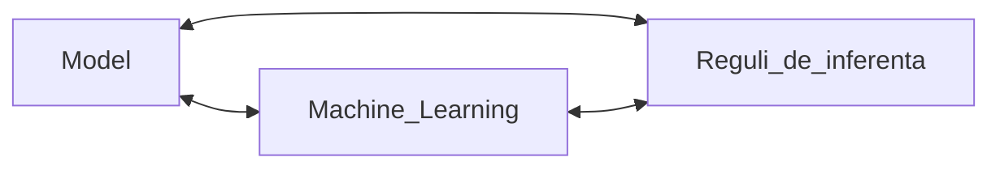

----
### Care era obiectivul initial al informaticii?
 - Dezvoltarea unei Inteligente Artificiale  

### Ce este testul Turing?
  - se dau 2 terminale in spate si se hotaraste care este un calculator si care este un om.
  - inteligenta umana are si limite inferioare si superioare
  - template-uri generice, devierea discutiei (echivalent cu comportamentul uman)
  - **IN PLUS**: roboteii Alice si Eliza in raport cu testul Turing
### Ce este camera chineza?
  - test care demonstreaza ineficienta testului Turing
  - persoana nu stie chineza se descurca totusi cu template-uri si trece testul Turing
### Diferenta intre Week AI si Strong AI
| Week AI                                              | Strong AI                                                           |
| ---------------------------------------------------- | ------------------------------------------------------------------- |
| orice program care urmareste un algoritm             | este inteles si contextul raspunsului                               |
| ex: program care calculeaza rezultatul unei expresii | ex: se foloseste de context pentru a-l deduce, nu sunt folosite tem |
### Diferenta intre Connectionism si Computationalism
| Connectionism                                                                                      | Computationalism           |
| -------------------------------------------------------------------------------------------------- | -------------------------- |
| o structura suficient de complexa precum creierul uman trebuie sa reactioneze precum creierul uman | recunoasterea de structuri |
| ex: retele neuronale                                                                               | ex: culori                           |
### Tipuri de AI -> comportament/gandire rationala/umana
1) Comportament uman
2) Gandire umana
3) Gandire rationala (deductia naturala)
4) Comportament rational (raspuns rapid) (**IMPORTANT**: cel mai folosit)
### Structura unui engine AI
 - Reguli de inferenta, model si Machine learning

### Ce inseamna modelarea?
 - transpunerea datelor reale in informatie ce poate fi inteleasa de calculator
 - implica pierdea de informatii
 - e facuta de catre noi
### Ce inseamna Reguli de inferenta
 - completarea unor informatii pe care le am cu alte informatii
### Ce inseamna Machine learning?
 - descoperirea unor pattern-uri
### Abordari
1) Model bazate de stari 
		- programul stie toate informatiile necesare luarii deciziilor si ia decizii pana cand ajunge intr-o stare acceptata
		- singura abordare posibila in jocuri
2) Model bazat pe variabile
		- usor de evaluat impactul unei decizii luate de calculator
		- solutia gasita mai repede (se identifica deciziile cu impact bun)